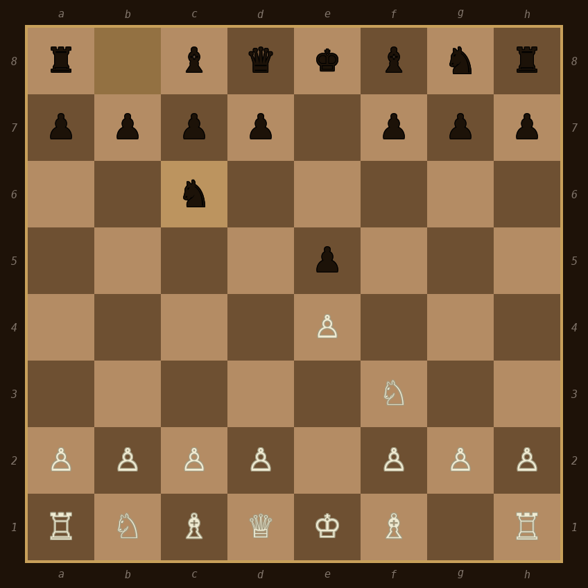
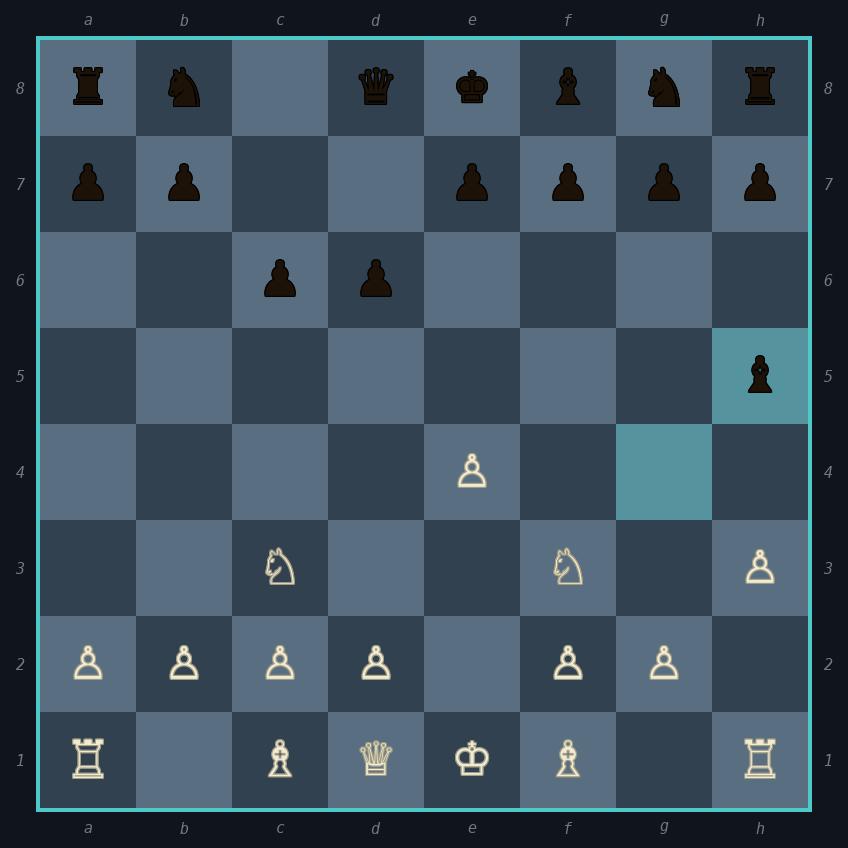

<div align="center">

# ♟ rchess

A fully-featured chess game that runs entirely in your terminal.

[](https://rustup.rs)
[](https://aur.archlinux.org/packages/rchess)
[](#)

</div>

---

## What it does

rchess is a terminal chess game with a built-in AI, real-time move analysis, opening book, Lichess daily puzzles, PNG/PGN export, and full mouse support. No GUI needed.

---

## Installation

### Arch Linux — AUR

```bash
yay -S rchess
# or
paru -S rchess
```

### From source

```bash
git clone https://github.com/yourname/rchess
cd rchess
cargo build --release
./target/release/rchess
```

### Optional dependencies

```bash
# PNG board export (Shift+E in-game)
sudo pacman -S python-pillow

# Stronger move analysis
sudo pacman -S stockfish

# Unicode chess symbols (♔♕♖) in PNG export
sudo pacman -S ttf-freefont

# HTTPS certificates for Lichess puzzle API
sudo pacman -S ca-certificates
```

---

## Controls

| Key | Action |
|-----|--------|
| `↑↓←→` / `hjkl` | Move cursor |
| `Enter` / `Space` / click | Select & move |
| Type a move | `e2e4` · `Nf3` · `O-O` · `O-O-O` |
| `u` | Undo |
| `T` | Cycle UI mode (Minimal / Standard / Analysis) |
| `E` (Shift) | Export board as PNG |
| `G` (Shift) | Save game as PGN |
| `r` | Replay game |
| `d` | Offer draw (PvP) |
| `n` | New game |
| `s` | Settings |
| `q` | Menu |

### Replay controls

| Key | Action |
|-----|--------|
| `←/h` · `→/l` | Step back / forward |
| `0` / `$` | Jump to start / end |
| `E` | Export current position as PNG |

---

## Move analysis

Every move is evaluated in the background and labelled:

| Icon | Label | What it means |
|------|-------|---------------|
| `B` | Book | Known opening line |
| `+` | Good | Sound move |
| `?!` | Inaccuracy | Small slip (−0.5 to −1.0p) |
| `?` | Mistake | Significant error (−1.0 to −3.0p) |
| `??` | Blunder | Serious mistake (worse than −3.0p) |

Labels appear live in the history panel without pausing the game. Switch to **Analysis mode** (`T`) to see the top 3 candidate moves, eval before/after, and an eval sparkline in Replay.

### Engine options

| Engine | Speed | How to enable |
|--------|-------|---------------|
| Built-in d1 | ~1ms | Default |
| Built-in d2 | ~5–50ms | Settings → Analysis depth |
| Built-in d3 | ~50–500ms | Settings → Analysis depth |
| Stockfish | 300ms/pos | `sudo pacman -S stockfish`, Settings → Analysis engine |

---

## PNG export

`Shift+E` → preview → `Y` to confirm. Saved to `~/rchess_export/`.

Fonts are auto-detected using `fc-list` — your Nerd Font will work automatically if it has chess glyphs. Otherwise:

```bash
sudo pacman -S ttf-freefont
```

---

## Lichess daily puzzle

From the main menu → **Daily Puzzle**. The puzzle board has full mouse support — click to select and move pieces.

The API works anonymously, but a free token removes rate limits and is strongly recommended.

### Getting a Lichess API token

1. Create a free account at [lichess.org](https://lichess.org)
2. Go to **lichess.org/account/security** → scroll down to **Personal API tokens**
3. Click **Generate a personal API token**
4. Give it any name (e.g. `rchess`)
5. **Leave every permission checkbox unchecked** — the puzzle endpoint is public
6. Click **Submit** and copy the token (starts with `lip_`)

### Adding the token to rchess

Edit (or create) `~/.config/rchess/rchess_tui.conf`:

```ini
lichess_token = lip_xxxxxxxxxxxxxxxxxxxx
```

You can also set it via `s` → Settings → the token status is shown there. After adding the token, restart rchess and try the puzzle again.

---

## Config file

**Location:** `~/.config/rchess/rchess_tui.conf`

Created automatically when you press `w` in Settings. All options:

```ini
theme            = classic       # classic tournament mocha slate midnight crimson
piece_style      = unicode       # unicode letters fatletters
ai_depth         = 3             # 1=Easy  2=Medium  3=Hard  4=Expert
move_hints       = dots          # dots highlight none
time_control     = infinite      # infinite bullet blitz rapid classical
show_coords      = true
show_clock       = true
flip_board       = false
auto_flip        = false         # auto-flip board each turn in PvP
confirm_move     = false
ui_mode          = standard      # minimal standard analysis
analysis_engine  = builtin       # builtin stockfish
analysis_depth   = 2             # 1=fast  2=balanced  3=strong
blunder_cp       = 300           # centipawns threshold for Blunder label
mistake_cp       = 100           # centipawns threshold for Mistake label
inaccuracy_cp    = 50            # centipawns threshold for Inaccuracy label
stockfish_skill  = 10            # Stockfish skill level 0-20
auto_save_png    = false         # auto-save PNG when game ends
lichess_token    = lip_xxx       # your Lichess API token (optional)
```

---

## Opening book

The CPU uses a built-in opening book for the first ~15 moves. The current opening name is shown in the top bar (`[Sicilian — Najdorf]`).

Covered: Ruy López, Italian, Scotch, Sicilian (Najdorf, Dragon, Kan), French, Caro-Kann, Queen's Gambit, King's Indian, Nimzo-Indian, London, Réti, English, and more.

---

## Exports

Both saved to `~/rchess_export/`:

| File | Trigger |
|------|---------|
| `rchess_board_<timestamp>.png` | `Shift+E` in-game or replay, or auto on game end |
| `rchess_<movenum>.pgn` | `Shift+G` in-game, or auto on game end |

---

## Requirements

| | Version | Notes |
|-|---------|-------|
| Rust + Cargo | 1.70+ | [rustup.rs](https://rustup.rs) — build dependency only |
| Terminal | 115×32+ recommended | Smaller works in Minimal mode |
| Python + Pillow | any | PNG export only |
| Stockfish | any | Analysis only |

---

## Debug log

All internal output goes to `/tmp/rchess.log` — the terminal stays clean.

```bash
tail -f /tmp/rchess.log
```

---

## Preview

<div align="center">





</div>
